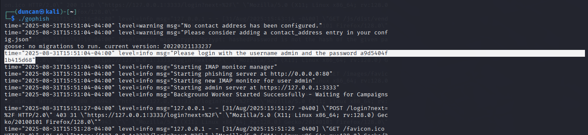
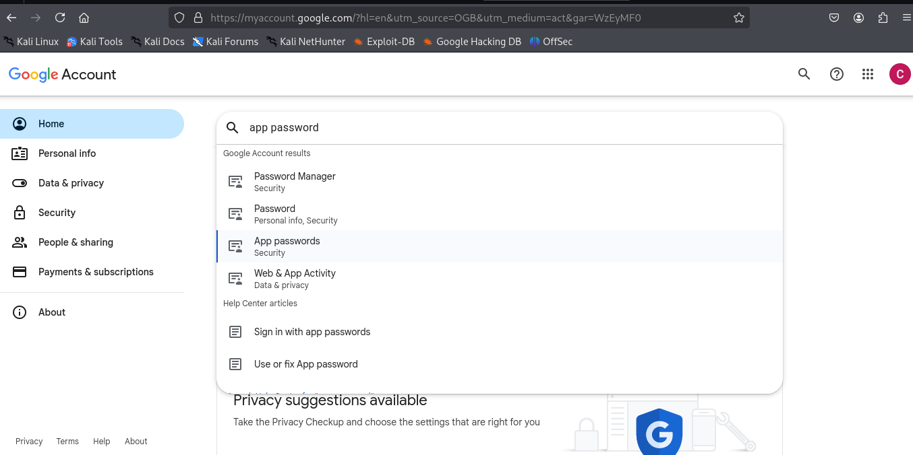
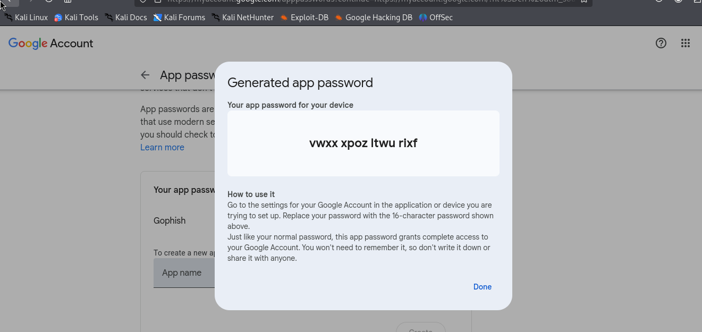
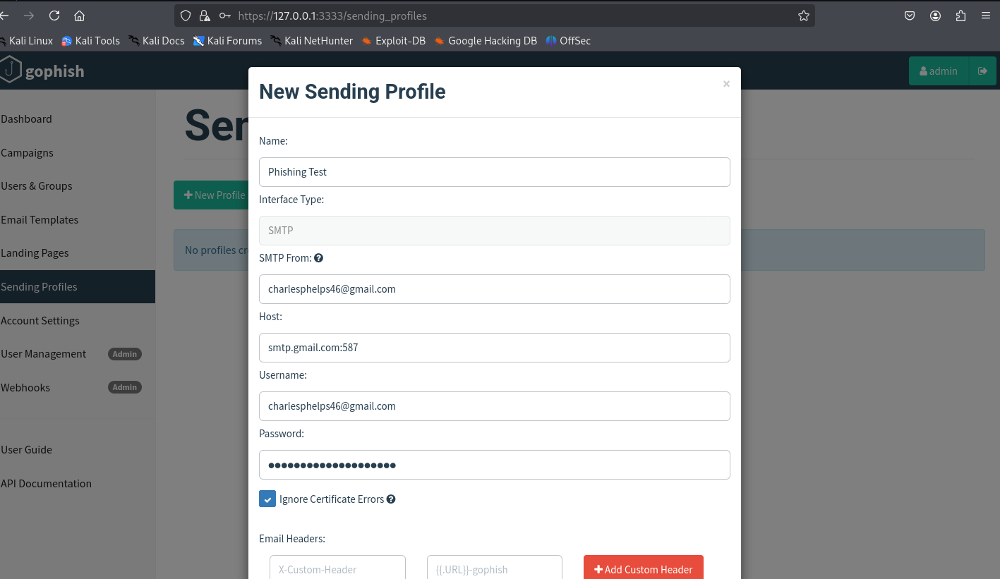
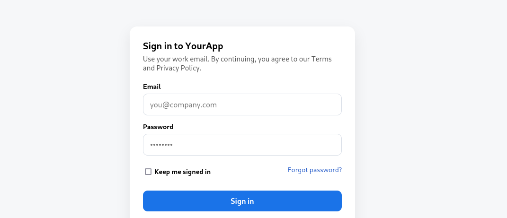
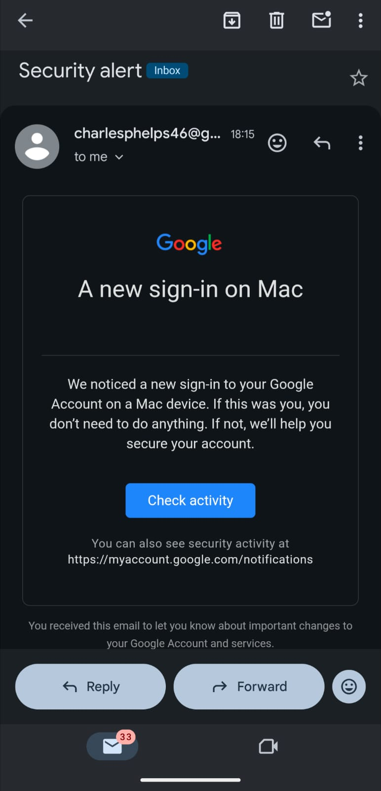
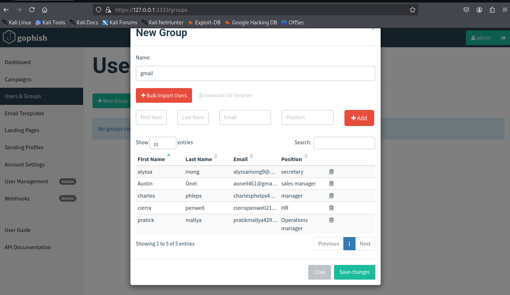
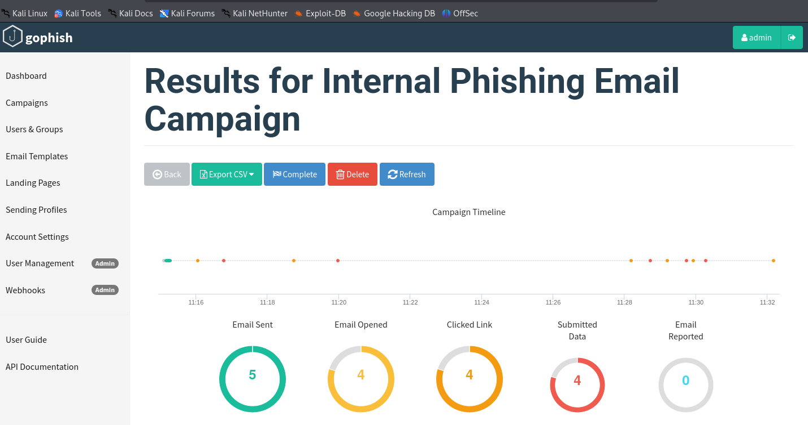
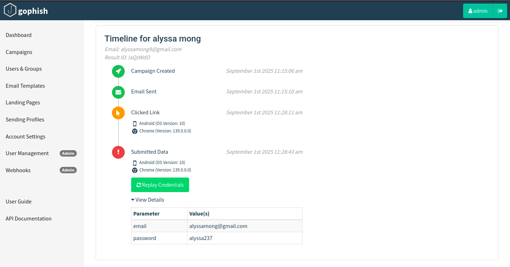

# Phishing Simulation With Gophish  

## 1. Introduction  

This project involved setting up and running a phishing simulation using the Gophish framework. The goal was to understand how phishing campaigns are created, deployed, and tracked, while also identifying common issues that arise during configuration and testing. The exercise was conducted in a controlled and ethical environment for research and training purposes..


## 2. Purpose of the Project 

- Provide a detailed record of the phishing simulation workflow, tools, and configurations used.  
- Highlight technical challenges encountered during setup and the solutions implemented.  
- Demonstrate the effectiveness of phishing simulations in identifying vulnerabilities in email security and user awareness.  
- Serve as a reference for refining future phishing campaigns, improving training materials, and enhancing organizational defenses against phishing threats.  


## 3. Tools Used  

- **Gophish Framework:** Used for creating, managing, and launching phishing campaigns.    
- **Web Browser:** Used to interact with the Gophish dashboard and access the landing pages.  
- **Custom HTML Code:** Handwritten fake login pages for credential harvesting simulations.  
- **SMTP Server (Gmail-based):** For sending phishing emails.  
- **Bash:** For server setup, IP configuration, and network testing.

## 4. Methodoloy

### 4.1 Setup  

Start the gophish    
```
wget https://github.com/gophish/gophish/releases/download/v0.12.1/gophish-v0.12.1-linux-64bit.zip  
```

Unzip the contents of file inside the gophish binary 

```
unzip gophish-v0.12.1-linux-64bit.zip
```
Moves the extracted folder so you can access the files inside it.  
```
cd gophish-v0.12.1-linux-64bit
```
make the file executable  
```
chmod +x gophish
```
Run the program  
```
./gophish
```
### 4.2 Ip Address Used  

**Phishing Host IP Address:** https://127.0.0.1:3333
 This IP was used to host the phishing landing pages and serve the HTML content to targets.

- You will be given a default password which you must change the password in the first time.
  


### 4.2 Gmail SMTP server configuration  

In your gmail account, on the search bar **App password** 

  

Gmail will redirect you to enter your password for confirmation, and for you to get the temporary password you must have authenticated your email with phone no or Authenticator App.  

  

### 4.3 Sending Profile  

On the sending profile I used gmail SMTP server and port   
```
smtp.gmail.com:587
```
  

When in the password you enter the one time password provided by gmail and save the profile.

  

### 4.4 Landing Page  

I made a basic **HTML** landing page resembling exactly gmail login page to capture **email** and **password,** and the target user logs in the credentials are captured and they will be redirected to the real gmail page making it look real and unnoticed.  

  

### 4.5 Email Template  

For the email template I used the source for the original email, this ensures it carries all the features of the email reducing the chances of target user to know the phish email.  

  

### 4.6 Setting the Target  

I made a small list of email to send Phishing email, you can also import in bulk.  

  

### 4.7 Creating campaigns  

During campaign launch, the IP address configured should be the local IP of your Kali system.

  

### 4.8 Results  

Phishing email was sent successful to all the target users and click they clicked entering thier credentials.  

  

The results were as shown below four of target users submitted their credentials.    

[screenshot](images/project/report2.png)  

This is sample of credentials captured, user **email** and **password** were captured.  

  


